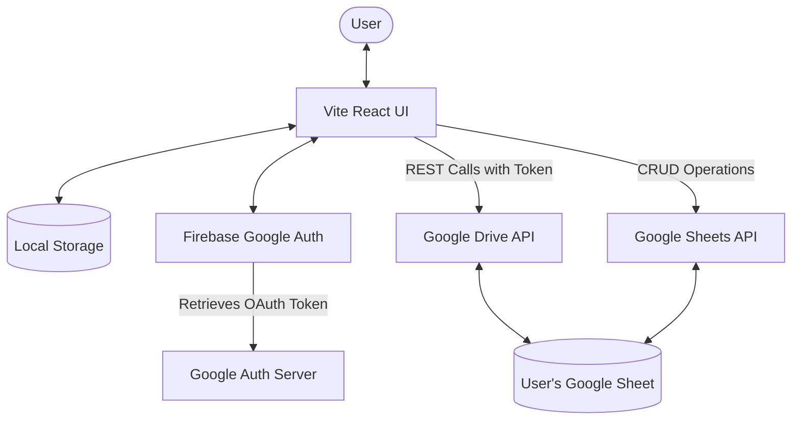
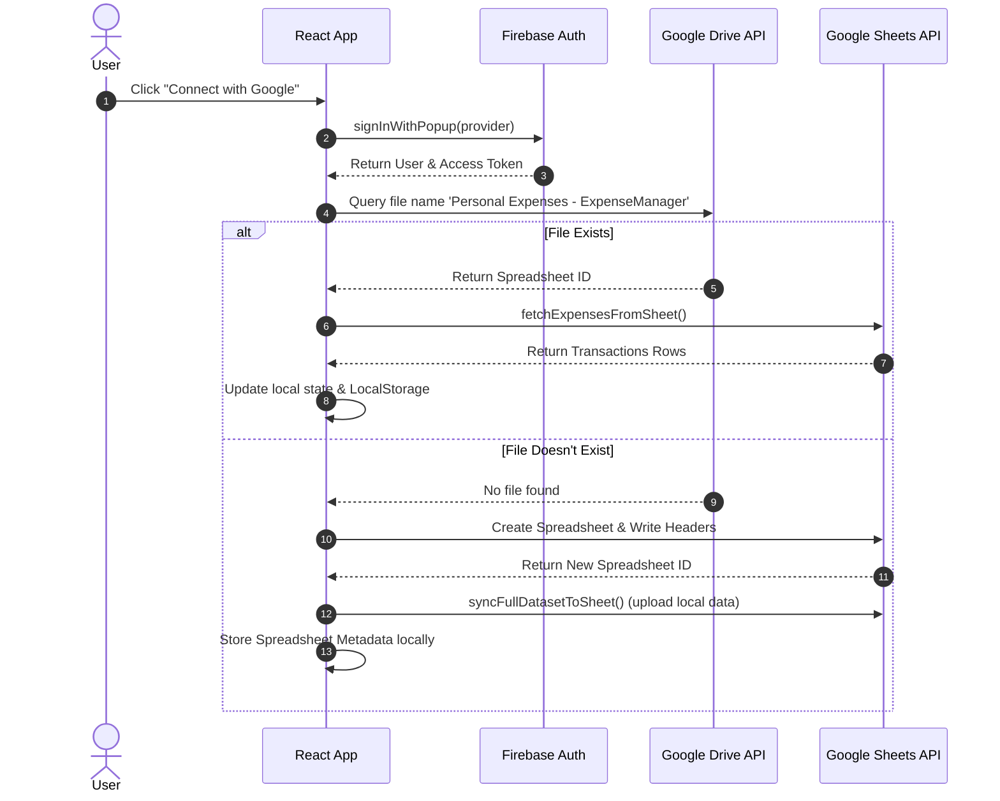
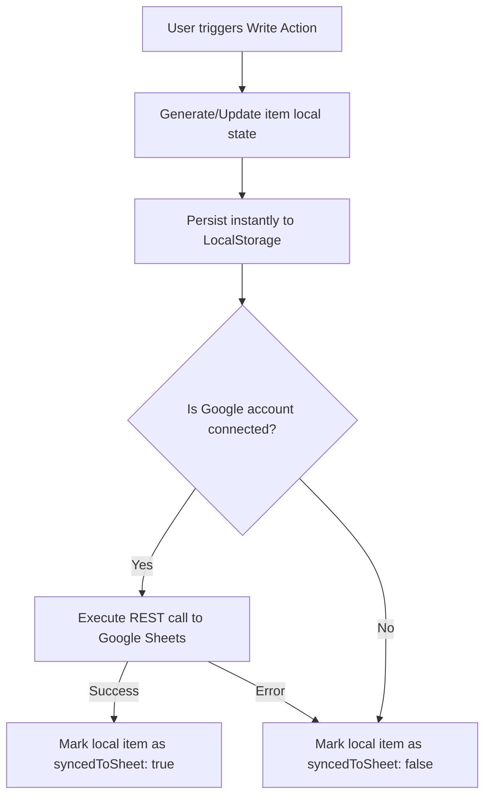

# Expense Manager - Personal Budget & Charts

Expense Manager is a modern, privacy-focused, client-side personal finance tracking application. It features real-time data visualization charts and integrates seamlessly with Google Sheets and Google Drive for cloud backups and cross-device synchronization.

The application is built using a **local-first** approach: it remains fully functional offline, saves all your transactions locally, and uses Google OAuth via Firebase to securely sync data with a private Google Spreadsheet in your own Google Drive.

---

## 🏗️ Architectural Decisions

### 1. Local-First & Optimistic UI
*   **Decoupled State**: App state (`expenses`, `budget`, `sheetMeta`) is stored in React state and mirrored instantly to `localStorage`.
*   **Offline Operation**: You can add, edit, or delete transactions without any internet connection. The app queues the changes and performs optimistic UI updates locally.
*   **Background Sync**: When the network is available and the user is authenticated, the app automatically executes sheets-sync actions (e.g., adding rows, updating rows, deleting dimensions) in the background, minimizing UI blockages.

### 2. Client-Side REST Sheets Integration
*   **No Dedicated Backend**: The application communicates directly with Google's v3 Drive and v4 Sheets APIs from the client browser. This eliminates the need for a custom server/database, maximizing user privacy and minimizing hosting costs.
*   **Scoped Permissions**: Firebase Auth is configured to ask for selective, minimum required permissions:
    *   `https://www.googleapis.com/auth/spreadsheets` (to view and manage spreadsheets the app interacts with)
    *   `https://www.googleapis.com/auth/drive.file` (to search and create the specific app spreadsheet)

### 3. Google Sheets as a Database
*   **Row-Level Operations**: Instead of redownloading the entire sheet on every CRUD operation:
    *   **Create**: Appends a row to the end of the sheet using the `append` API.
    *   **Update**: Finds the matching row index (using `rowIndex` cached state or column-search) and updates only that range.
    *   **Delete**: Issues a `deleteDimension` request via `batchUpdate` to remove the exact row.
*   **Conflict Resolution**: Full dataset sync utilities (`push` and `pull` force options) are provided inside the settings panel to allow manual reconciliation when editing spreadsheets externally.

---

## 🔄 Application Flow & Lifecycles

### 🗺️ System Architecture



---

### 🔑 Authentication & Sheet Connection flow
1.  **On Startup**: The app reads cached configuration, budgets, and transactions from `localStorage`.
2.  **Sign-In**: The user triggers Google Sign-in. Firebase opens a popup, authenticates the user, and fetches a Google OAuth2 access token.
3.  **Discovery/Setup**:
    *   The app queries Google Drive for an existing spreadsheet named `Personal Expenses - ExpenseManager`.
    *   **If found**: It retrieves the sheet ID and downloads any existing transactions to sync them locally.
    *   **If not found**: It creates a new spreadsheet, designs a custom schema (Header Row, freeze settings), and uploads any existing local transactions.



---

### 💾 Transaction Lifecycle (CRUD Sync)
Whenever a user performs a write operation (Add, Edit, Delete):



*   **Create**: Local state adds item -> `appendExpenseToSheet()` call -> updates local sync status.
*   **Update**: Local state modifies item -> `updateExpenseInSheet()` call targeting specific row range -> updates local sync status.
*   **Delete**: Local state removes item -> `deleteExpenseFromSheet()` calls `deleteDimension` API for the row -> updates local state.

---

## 📂 Project Structure

```bash
expense-manager/
├── firebase-applet-config.json  # Firebase client credentials
├── package.json                 # Core dependencies (React, Recharts, Tailwind v4, Lucide)
├── vite.config.ts               # Vite configuration with Tailwind CSS plugin
├── src/
│   ├── main.tsx                 # Application entry point
│   ├── App.tsx                  # Core state, sync orchestration, and routing
│   ├── types.ts                 # TypeScript interfaces (ExpenseItem, FilterState, etc.)
│   ├── index.css                # Tailwind global imports and variables
│   ├── components/              # Modular UI Components
│   │   ├── Header.tsx           # Brand header, user profiles, tab navigation
│   │   ├── SummaryCards.tsx     # KPI metrics (Income, Expense, Savings, Budget Progress)
│   │   ├── ExpenseList.tsx      # Multi-filter transaction search, action buttons, table view
│   │   ├── AnalyticsView.tsx    # Interactive charts built with Recharts
│   │   ├── BudgetManager.tsx    # Detailed category-wise budgeting settings
│   │   ├── ExpenseModal.tsx     # Popup form for adding/editing transactions
│   │   ├── DeleteConfirmModal.tsx # Safety validation modal
│   │   └── SheetSettingsModal.tsx # Sync settings, URL links, force push/pull operations
│   ├── services/                # External Integrations
│   │   ├── firebaseAuth.ts      # Authentication wrapper and scopes setup
│   │   ├── googleSheets.ts      # Sheets API wrappers (fetch, append, update, delete, clear)
│   │   └── storage.ts           # LocalStorage helpers for offline persistence
│   └── utils/
│       └── helpers.ts           # Utilities: computation of analytics, filtering, currency, CSV exports
```

---

## 🚀 Running Locally

### Prerequisites
*   [Node.js](https://nodejs.org/) (v18 or higher recommended)
*   [npm](https://www.npmjs.com/) or [bun](https://bun.sh/)

### 🛠️ Setup Steps

1.  **Install dependencies**:
    ```bash
    npm install
    # or
    bun install
    ```

2.  **Configuration**:
    The project is pre-configured with a default Firebase Applet Sandbox in `firebase-applet-config.json` for immediate local authentication.
    
    If you wish to use your own Firebase and Google Cloud project:
    *   Create a Firebase project.
    *   Enable Google Sign-in provider.
    *   Add the `https://www.googleapis.com/auth/spreadsheets` and `https://www.googleapis.com/auth/drive.file` scopes in your console configuration.
    *   Replace values in [firebase-applet-config.json](firebase-applet-config.json) with your web app configuration credentials.

3.  **Run Development Server**:
    ```bash
    npm run dev
    ```
    Open `http://localhost:3000` to view the application.

4.  **Lint & Build**:
    ```bash
    # Run TypeScript validation
    npm run lint

    # Build production assets
    npm run build
    ```
